# A Great Game

## Functional Description

This game is a role play game, where the player moves one or more characters in a world. The player moves and guides
his characters in the world, exploring it and eventually fighting against enemies.
This project uses libgdx (see https://libgdx.com/).

The Game Modes
- The game is organized in modes, every mode is played differently
- The game will start in menu mode, where the player can load one of the game or create a new one
- When voyaging through great distances, the game is in trip mode
- In trip mode, the player will be able to move the character in a great map, in a small amount of time
- When voyaging, the player can choose to start exploring, the game will enter the exploring Mode
- In exploring mode, the Player moves freely in the world, moving at their real speed in real time, seeing all creatures
and objects around him.
- If the character is exploring or voyaging, and they start a fight, the game will enter in fight Mode
- In fight mode, the game is organized in turns: every Creature can act only in its turn.
- In the turn, a Creature can take two actions
- Attack, move, collect objects are actions
- Anytime in the game, the player can pause the game (MainMenu Mode, but with a slightly different interface)

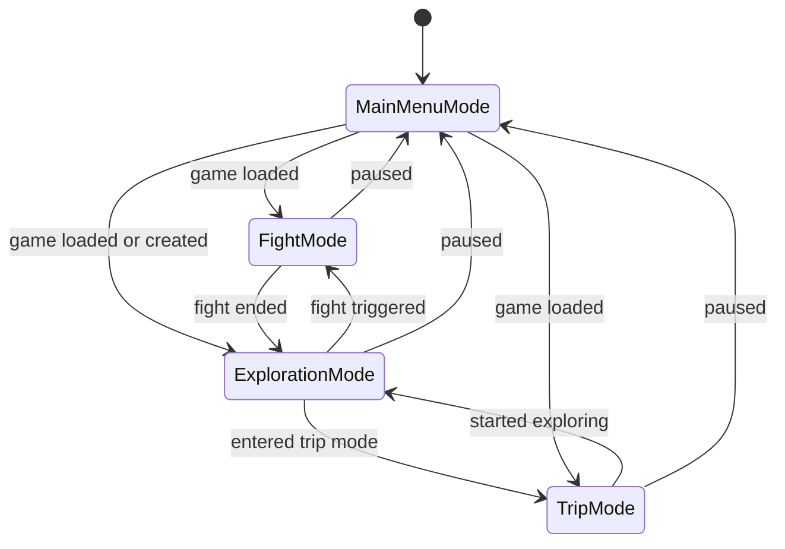
```mermaid
stateDiagram
    [*] --> MainMenuMode
    MainMenuMode --> FightMode : game loaded
    FightMode --> MainMenuMode : paused
    MainMenuMode --> ExplorationMode : game loaded or created
    ExplorationMode --> FightMode : fight triggered
    ExplorationMode --> MainMenuMode : paused
    FightMode --> ExplorationMode : fight ended
    TripMode --> ExplorationMode : started exploring
    ExplorationMode --> TripMode : entered trip mode
    MainMenuMode --> TripMode : game loaded
    TripMode --> MainMenuMode : paused
```

The Game Rules
- All playing and not playing characters and monsters are Creatures
- All Creatures have two Characteristics: physique and agility
- The values of the Characteristics are positive integers. Every Characteristic is associated to a bonus, calculated
by this function: floor((v - 10) / 2), where v is the Characteristic value.
- All Creatures have Skills that allow them to do all sort of stuff
- The player have a number of Experience Points: they spend them to increase their level in a Skill
- If a Creature has a particular skill, it also has a level in that skill
- In the game, Creatures do skill checks, which have a target value: a random number between 1 and 20 is generated,
and a bonus is added. The bonus is calculated by a function, unique to every skill, that takes as parameter the
Creature that is doing the check. A common function is the one that takes the level of the skill as a bonus,
plus the bonus of a characteristic.
- Skill checks are used to fight, use magic, sneak, detect, talk, dodge ... everything.
- All Creatures have Health Points (HP). A Creature loses HP when is hit by attacks, and if the 
value drops to 0, the Creature is dead. HP can be restored, but can't be taken over a maximum.
- All Creatures have a speed value: in Fight mode, they can move a number of meters equal to their speed as an action.
In explore mode, they move a number of meters equal to their speed every three seconds.
- All Items (not animated things) in the game can be broken
- All Items and Creature have AC (armor class) and HP. The higher these values, the harder
is to break/kill them.
- Some Items can be picked by Creatures
- Some Items can be equipped by Creatures

The game world:
- The player moves in an open world, moving freely, in trip mode.
- There are grasslands and forests in the world.
- There are villages and camps in the world.
- In the villages there are many houses, with villagers.
- In the camps there are bandits, that are hostile.

## Package Design

This diagram shows the dependencies between the packages:

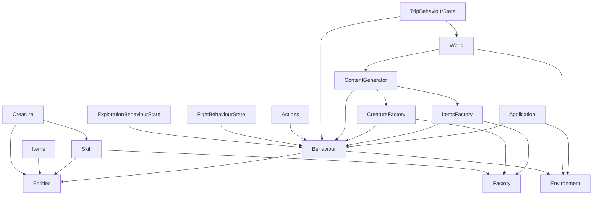
```mermaid
flowchart
    Skill --> Factory
    Creature --> Entities
    Items --> Entities
    Skill --> Entities
    Creature --> Skill
    ExplorationBehaviourState --> Behaviour
    FightBehaviourState --> Behaviour
    Actions --> Behaviour
    TripBehaviourState --> Behaviour
    Behaviour --> Entities
    Behaviour --> Environment
    TripBehaviourState --> World
    World --> ContentGenerator
    ContentGenerator --> Behaviour
    ContentGenerator --> CreatureFactory
    ContentGenerator --> ItemsFactory
    World --> Environment
    CreatureFactory --> Behaviour
    CreatureFactory --> Factory
    ItemsFactory --> Behaviour
    ItemsFactory --> Factory
    Application --> Environment
    Application --> Behaviour
```

The packages of the game:
- **Entities**: it contains basic interfaces of the game
- **Environment**: it contains basic abstract classes used to manage the game world
- **Factory**: it contains a class to create Skills, Creatures, Items
- **Skills**: it contains an implementation of Skill and some interfaces
- **Creatures**: it contains an implementation of Creature and some interfaces
- **Items**: it contains an implementation of Item and some interfaces
- **Behaviour**: it contains the Behaviour, used to update the Items and Creatures.
- **ExplorationBehaviourState**: it contains the abstract class used by Creatures to act
in Exploration Mode and its implementations.
- **FightBehaviourState**: it contains the abstract class used by Creatures to act
in Fight Mode and its implementations.
- **Action**: it contains the Action class, used by Creatures in its BehaviourStates
- **TripBehaviourState**: it contains the abstract class used by Creatures to act
in Trip Mode and its implementations.
- **CreatureFactory**: it contains the Factory that generates Creatures
- **ItemsFactory**: it contains the Factory that generates Items
- **World**: it contains the world-class and some interfaces and classes to generate and
  manage it
- **Content Generator**: it contains the classes to generate single locations
- **Application**: it contains the main application and the mode class. It has some
subpackages:
  - **Exploration Mode**: it contains ExplorationMode
  - **Fight Mode**: it contains FightMode
  - **Trip Mode**: it contains TripMode
  - **Menu Mode**: it contains implementations of Modes for the Main menu

## Class Design

### Entities package

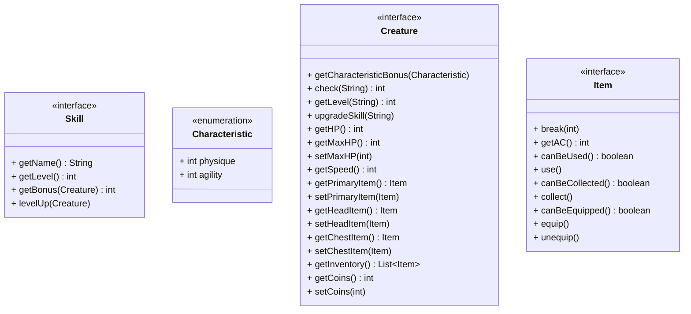
```mermaid
classDiagram
class Skill {
    <<interface>>
    + getName() String
    + getLevel() int
    + getBonus(Creature) int
    + levelUp(Creature)
}
class Characteristic {
    <<enumeration>>
    + int physique
    + int agility
}
class Creature {
    <<interface>>
    + getCharacteristicBonus(Characteristic)
    + check(String) int
    + getLevel(String) int
    + upgradeSkill(String)
    + getHP() int
    + getMaxHP() int
    + setMaxHP(int)
    + getSpeed() int
    + getPrimaryItem() Item
    + setPrimaryItem(Item)
    + getHeadItem() Item
    + setHeadItem(Item)
    + getChestItem() Item
    + setChestItem(Item)
    + getInventory() List~Item~
    + getCoins() int
    + setCoins(int)
}
class Item {
    <<interface>>
    + break(int)
    + getAC() int
    + canBeUsed() boolean
    + use()
    + canBeCollected() boolean
    + collect()
    + canBeEquipped() boolean
    + equip()
    + unequip()
}
```

The interfaces in this package represent basic concepts. The Characteristic enumeration simply defines the two
Characteristics. The Skill interface defines the basic methods needed by the skill: two methods to get the values of
the skill attributes, the name and the level, a method getBonus to get the Bonus associated to the Creature that is
making the skill check, a method levelUp to increase the level that a Creature has in that skill.

The Creature interface defines some methods to get the basic attributes of a Creature (characteristics, HP, MaxHP, speed, 
level of a skill, etc.), a method to make a skill check, a method to upgrade a skill.

The Item interface defines some methods to get the basic attributes of an Item and some methods about actions a
Creature can do to an Item.

### Environment package

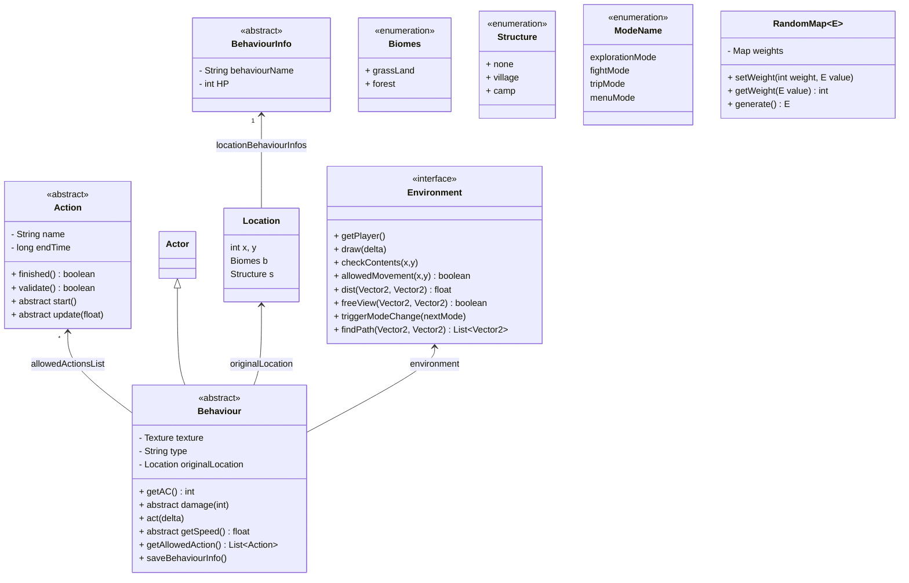
```mermaid
classDiagram
    class Location {
        int x, y
        Biomes b
        Structure s
    }
    BehaviourInfo "1" <-- Location : locationBehaviourInfos
    class Biomes {
        <<enumeration>>
        + grassLand
        + forest
    }
    class Structure {
        <<enumeration>>
        + none
        + village
        + camp
    }
    class BehaviourInfo {
        <<abstract>>
        - String behaviourName
        - int HP
    }
    class Environment {
        <<interface>>
        + getPlayer()
        + draw(delta)
        + checkContents(x,y)
        + allowedMovement(x,y) boolean
        + dist(Vector2, Vector2) float
        + freeView(Vector2, Vector2) boolean
        + triggerModeChange(nextMode)  
        + findPath(Vector2, Vector2) List~Vector2~
    }
    class ModeName {
        <<enumeration>>
        explorationMode
        fightMode
        tripMode
        menuMode
    }
    class Action {
        <<abstract>>
        - String name
        - long endTime
        + finished() boolean
        + validate() boolean
        + abstract start()
        + abstract update(float)
    }
    Action "*" <-- Behaviour : allowedActionsList
    class Behaviour {
        <<abstract>>
        - Texture texture
        - String type
        - Location originalLocation
        + getAC() int
        + abstract damage(int)
        + act(delta)
        + abstract getSpeed() float
        + getAllowedAction() List~Action~
        + saveBehaviourInfo()
    }
    Actor <|-- Behaviour
    Location <-- Behaviour : originalLocation
    Environment <-- Behaviour : environment
    class RandomMap~E~ {
        - Map weights
        + setWeight(int weight, E value)
        + getWeight(E value) int
        + generate() E
    }
```

The location class represents a little portion of the map that contains Items and Creatures. It
has a Biome, sometimes it contains a structure and is located in x,y. The BehaviourInfo class
(and its extensions) contains infos about Creatures and Items that will be used to save and
load the game: Creatures and Items will usually be generated procedurally at runtime, but if
one has already been generated and needs to be loaded from a file, this will be done using the
extensions of this class. Location class has a list of BehaviourInfo, the infos of the Items and
Creatures in it that were generated in it.

The environment interface will be used by Creatures to access to other things that are in the game:
- draw will update all the Creatures and Items in the game
- the checkContent(x,y) method checks if some of the items currently loaded are so far that can be deleted from
the scene (x,y are the coordinates of the location where the player currently is)
- allowedMovement(x,y) checks if the coordinates x,y of the scene are free from obstacles, so that Creatures can move
in the position.
- dist(V2, V2) returns the distance between the two points passed as parameter
- freeView(V2,V2) returns true if it's possible to draw a line between the two points without crossing obstacles
- triggerModeChange(mode) will make the game go to the mode passed as parameter
- findPath(V2,V2) will return a path of positions that a Creature can take to go from the first point to the second

The Behaviour abstract Class will update, in the game, frame by frame, both Items and
Creatures. For this, it inherits from Actor (see https://libgdx.com/wiki/graphics/2d/scene2d/scene2d), and with the
act(delta) method will render objects on the screen. The saveBehaviourInfo() method will add a BehaviourInfo class to
the Location, The BehaviourInfo class contains information that can't be procedurally generated: the HP of
the behaviour, if it was damaged, its position if it had moved, and so on. So this class and its extensions are just
information containers. This method will be called when the Behaviour is damaged or moves.

The RandomMap will be used in the game to generate random values with different probabilities: it has a map of
values, where the keys are the values, each associated to a weight. The greater the weight, the greater the probability
that the generate function will return that particular weight. The probability that a particular value is generated
is w/W, where w is the weight of the value and W the sum of the weights.

### Factory package

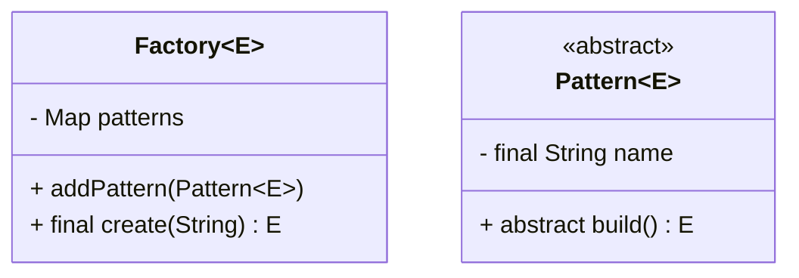
```mermaid
classDiagram
    class Factory~E~ {
        - Map<String, Pattern> patterns
        + addPattern(Pattern~E~)
        + final create(String) E
    }
    class Pattern~E~ {
        <<abstract>>
        - final String name
        + abstract build() E
    }
```

The class Factory provides a factory design pattern to create entities (E) like Skills, Creatures, etc. 
It has a map of instances of the Pattern abstract class (the keys are their names): when a string is passed to method
create, the name will be searched in the map, and the build method of the corresponding pattern will be called:

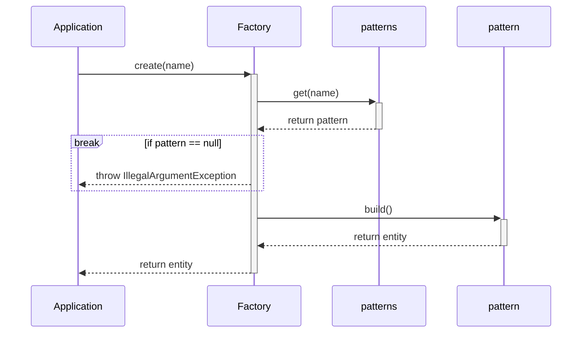
```mermaid
sequenceDiagram
    Application ->>+ Factory : create(name)
    Factory ->>+ patterns : get(name)
    patterns -->>- Factory : return pattern
    break if pattern == null
        Factory -->> Application : throw IllegalArgumentException
    end
    Factory ->>+ pattern : build()
    pattern -->>- Factory : return entity
    Factory -->>- Application : return entity
```

### Skills package

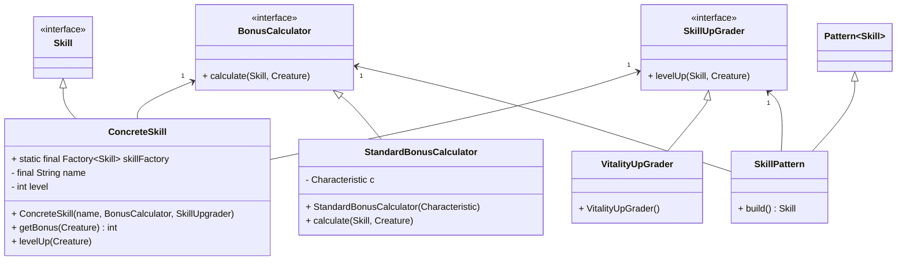
```mermaid
classDiagram
    class Skill {
        <<interface>>
    }
    class ConcreteSkill {
        + static final Factory~Skill~ skillFactory 
        - final String name
        - int level
        + ConcreteSkill(name, BonusCalculator, SkillUpgrader)
        + getBonus(Creature) int
        + levelUp(Creature)
    }
    class BonusCalculator {
        <<interface>>
        + calculate(Skill, Creature)
    }
    BonusCalculator "1" <-- ConcreteSkill
    Skill <|-- ConcreteSkill
    class SkillUpGrader {
        <<interface>>
        + levelUp(Skill, Creature)
    }
    SkillUpGrader "1" <-- ConcreteSkill
    class StandardBonusCalculator {
        - Characteristic c
        + StandardBonusCalculator(Characteristic)
        + calculate(Skill, Creature)
    }
    BonusCalculator <|-- StandardBonusCalculator
    class VitalityUpGrader {
        + VitalityUpGrader()
    }
    SkillUpGrader <|-- VitalityUpGrader
    class SkillPattern {
        + build() Skill
    }
    BonusCalculator "1" <-- SkillPattern
    SkillUpGrader "1" <-- SkillPattern
    Pattern~Skill~ <|-- SkillPattern
```

Every skill has a name, a level, an implementation of BonusCalculator interface that calculates the bonus of the skill 
for a  particular Creature, after being passed the skill and the Creature, and an implementation of SkillUpGrader
interface, to be called when the skill level goes up. The SkillUpGrader exists because some skills may have give some
additional effect when leveling up. The reference to the class, however, will be stored in an Optional, so it is nullable:
if it's null, the method levelUp will simply increase the level attribute.

This diagram shows how a skill check is made in the ConcreteSkill implementation:

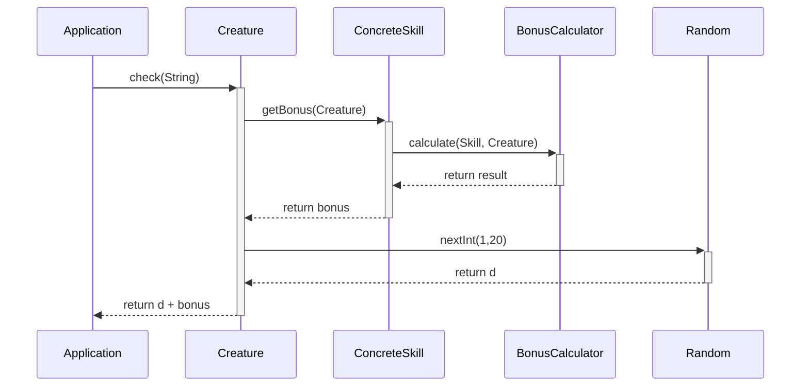
```mermaid
sequenceDiagram
    Application ->>+ Creature: check(String)
    Creature ->>+ ConcreteSkill : getBonus(Creature)
    ConcreteSkill ->>+ BonusCalculator : calculate(Skill, Creature)
    BonusCalculator -->>- ConcreteSkill : return result
    ConcreteSkill -->>- Creature : return bonus
    Creature ->>+ Random : nextInt(1,20)
    Random -->>- Creature : return d
    Creature -->>- Application : return d + bonus
```
*Note: the "Application" class, in both the diagrams, represent a generic class that calls the check Method on a
Creature*

The skill is upgraded by increasing its level and calling the SkillUpGrader.

The StandardBonusCalculator implements a very common function to calculate the Skill Bonus: the bonus is equal to the
level of the skill plus the Characteristic bonus of a Characteristic (passed in the constructor) of a Creature (passed as
a parameter in the function)

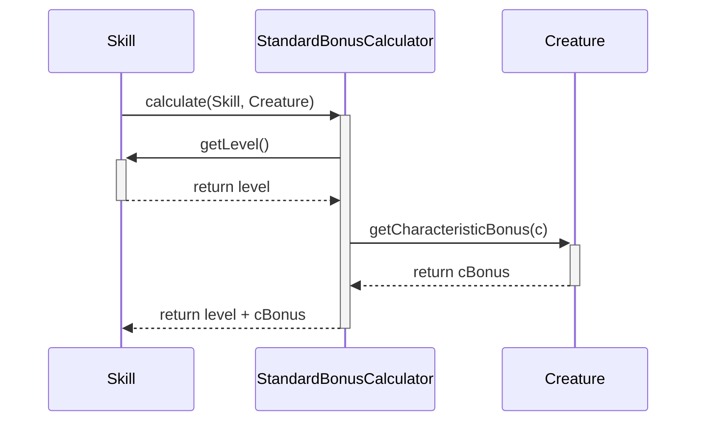
```mermaid
sequenceDiagram
    Skill ->>+ StandardBonusCalculator : calculate(Skill, Creature)
    StandardBonusCalculator ->>+ Skill : getLevel()
    Skill -->>- StandardBonusCalculator : return level
    StandardBonusCalculator ->>+ Creature : getCharacteristicBonus(c)
    Creature -->>- StandardBonusCalculator : return cBonus
    StandardBonusCalculator -->>- Skill : return level + cBonus
```

The VitalityUpGrader, in the Upgrade method, sets the MaxHealthPoints of the Creature as (skill.getLevel() + 
creature.getCharacteristicBonus(Physique)) * 6.

The skillFactory class will be used to create instances of the ConcreteSkill class. The build method of SkillPattern
(implementation of Pattern<Skill>) works as shown by the Diagram:

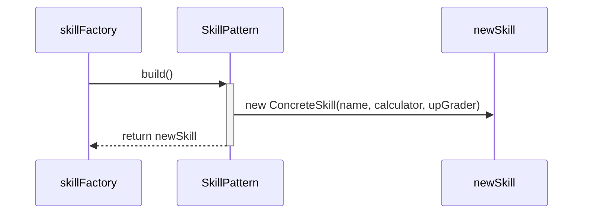
```mermaid
sequenceDiagram
    skillFactory ->>+ SkillPattern : build()
    SkillPattern ->> newSkill : new ConcreteSkill(name, calculator, upGrader)
    SkillPattern -->>- skillFactory : return newSkill
```

| name          | calculator         | upGrader           |
|---------------|--------------------|--------------------|
| archery       | standard(agility)  | null               |
| bite          | standard(physique) | null               |
| fencing       | standard(physique) | null               |
| unarmed fight | standard(physique) | null               |
| vitality      | standard(physique) | vitalityUpGrader() |

### Creatures package

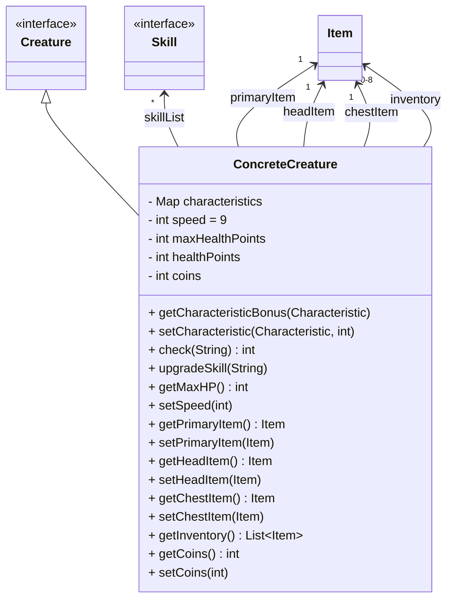
```mermaid
classDiagram
    class Creature {
        <<interface>>
    }
    class Skill {
        <<interface>>
    }
    class ConcreteCreature {
        - Map<Characteristic,int> characteristics
        - int speed = 9
        - int maxHealthPoints
        - int healthPoints
        - int coins
        + getCharacteristicBonus(Characteristic)
        + setCharacteristic(Characteristic, int)
        + check(String) int
        + upgradeSkill(String)
        + getMaxHP() int
        + setSpeed(int)
        + getPrimaryItem() Item
        + setPrimaryItem(Item)
        + getHeadItem() Item
        + setHeadItem(Item)
        + getChestItem() Item
        + setChestItem(Item)
        + getInventory() List~Item~
        + getCoins() int
        + setCoins(int)
    }
    Creature <|-- ConcreteCreature
    Skill "*" <-- ConcreteCreature : skillList
    Item "1" <-- ConcreteCreature : primaryItem
    Item "1" <-- ConcreteCreature : headItem
    Item "1" <-- ConcreteCreature : chestItem
    Item "0-8" <-- ConcreteCreature : inventory
```

Every ConcreteCreature instance has a map that has the Skills as keys and their levels as values and a map that has
the Characteristics as keys and their values. The Characteristics will be all set to 10, by default.
The upgradeSkill method follows this process:

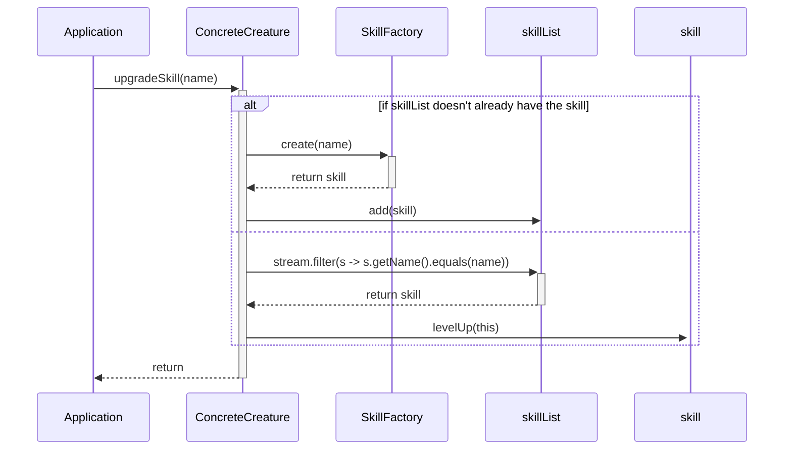
```mermaid
sequenceDiagram
    Application ->>+ ConcreteCreature : upgradeSkill(name)
    alt if skillList doesn't already have the skill
        ConcreteCreature ->>+ SkillFactory : create(name)
        SkillFactory -->>- ConcreteCreature : return skill
        ConcreteCreature ->> skillList : add(skill)
    else
        ConcreteCreature ->>+ skillList : stream.filter(s -> s.getName().equals(name))
        skillList -->>- ConcreteCreature : return skill
        ConcreteCreature ->>+ skill : levelUp(this)
    end
    ConcreteCreature -->>- Application : return
```

### Items package

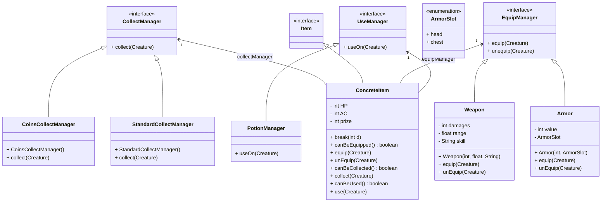
```mermaid
classDiagram
    class CollectManager {
        <<interface>>
        + collect(Creature)
    }
    CollectManager "1" <-- ConcreteItem : collectManager
    class StandardCollectManager {
        + StandardCollectManager()
        + collect(Creature)
    }
    CollectManager <|-- StandardCollectManager
    class CoinsCollectManager {
        + CoinsCollectManager()
        + collect(Creature)
    }
    CollectManager <|-- CoinsCollectManager
    class Item {
        <<interface>>
    }
    class ConcreteItem {
        - int HP
        - int AC
        - int prize
        + break(int d)
        + canBeEquipped() boolean
        + equip(Creature)
        + unEquip(Creature)
        + canBeCollected() boolean
        + collect(Creature)
        + canBeUsed() boolean
        + use(Creature)
    }
    Item <|-- ConcreteItem
    class EquipManager {
        <<interface>>
        + equip(Creature)
        + unequip(Creature)
    }
    EquipManager "1" <-- ConcreteItem : equipManager
    class Armor {
        - int value
        - ArmorSlot
        + Armor(int, ArmorSlot)
        + equip(Creature)
        + unEquip(Creature)
    }
    class ArmorSlot {
        <<enumeration>>
        + head
        + chest
    }
    EquipManager <|-- Armor
    class Weapon {
        - int damages
        - float range
        - String skill
        + Weapon(int, float, String)
        + equip(Creature)
        + unEquip(Creature)
    }
    EquipManager <|-- Weapon
    class UseManager {
        <<interface>>
        + useOn(Creature)
    }
    UseManager "1" <-- ConcreteItem
    class PotionManager {
        + useOn(Creature)
    }
    UseManager <|-- PotionManager
```

The ConcreteItem class implements the Item interface. The break method inflicts HP, lowering the item's HP. Every
ConcreteItem has an Optional<EquipManager> equipManager. If the Item can be equipped (is a weapon or an armor), the
instance inside the Optional will be an implementation of EquipManager interface. Else it will be null. Every 
ConcreteItem has an Optional<CollectManager> collectManager. If the Item triggers particular effects when is collected, 
the instance inside the Optional will be an implementation of CollectManager interface. Else it will be null. Every
ConcreteItem has an Optional<UseManager> useManager. If the Item triggers particular effects when is used,
the instance inside the Optional will be an implementation of UseManager interface. Else it will be null.

The Armor implementation of EquipManager interface increases the AC of the Creature when equipped and decreases it
when unequipped (by the value). If the ArmorSlot value is head, it will set the item as HeadItem, if the ArmorSlot
value is chest, it will set the item as HeadItem

The Weapon implementation of EquipManager interface sets the Primary Item of the Creature as itself when equipped,
if the Primary Item is null, and set it as null when unequipped. The String skill is the name of the Skill needed to use
the weapon.

The StandardCollectManager implementation of CollectManager interface will add the Item to the Creature's inventory in the
collect method, if it's not full (8 items).

The CoinsCollectManager implementation of CollectManager interface will increase the Creature's coins by 25 in the
collect method.

The PotionManager implementation of UseManager increases the Creature's HP by 5.

### Behaviour package

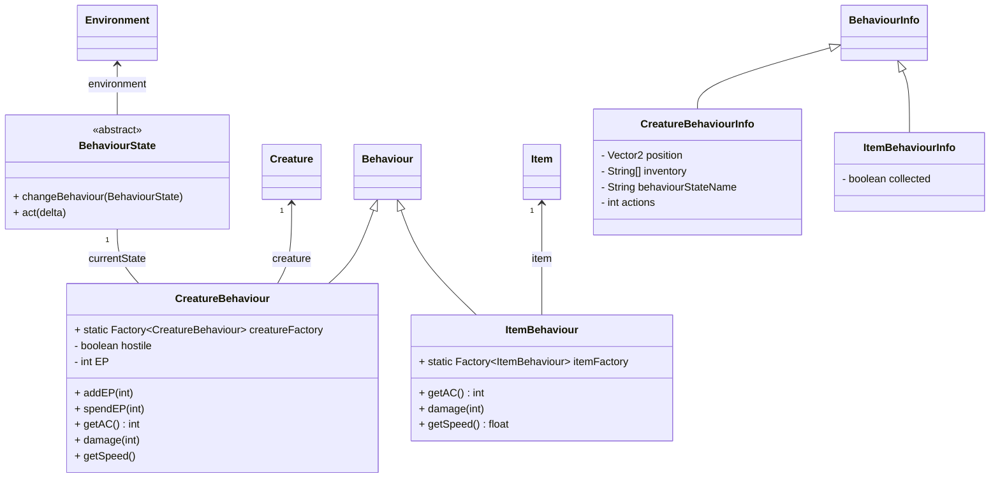
```mermaid
classDiagram
    class CreatureBehaviour {
        + static Factory~CreatureBehaviour~ creatureFactory
        - boolean hostile
        - int EP
        + addEP(int)
        + spendEP(int)
        + getAC() int
        + damage(int)
        + getSpeed()
    }
    Behaviour <|-- CreatureBehaviour
    Creature "1" <-- CreatureBehaviour : creature
    class BehaviourState {
        <<abstract>>
        + changeBehaviour(BehaviourState)
        + act(delta)
    }
    Environment <-- BehaviourState : environment
    BehaviourState "1" -- CreatureBehaviour : currentState
    Item "1" <-- ItemBehaviour : item
    class ItemBehaviour {
        + static Factory~ItemBehaviour~ itemFactory
        + getAC() int
        + damage(int)
        + getSpeed() float
    }
    Behaviour <|-- ItemBehaviour
    class CreatureBehaviourInfo {
        - Vector2 position
        - String[] inventory
        - String behaviourStateName
        - int actions
    }
    BehaviourInfo <|-- CreatureBehaviourInfo
    class ItemBehaviourInfo {
        - boolean collected
    }
    BehaviourInfo <|-- ItemBehaviourInfo
```

The CreatureBehaviour class will be used to call the act(delta) method of the BehaviourState instance, that will
make the Creature actually move, attack and so on. Also, the act() method of CreatureBehaviour will check that the
Creature still has more than 0 HP. If it doesn't, the method will "drop" all the Inventory (add the Items to the
environment all around), then remove the Behaviour from the environment.
The saveBehaviourInfo will create a CreatureBehaviourInfo with the current HP, current position, current inventory,
current behaviourStateName and add it to the location of the Behaviour.
The saveBehaviourInfo will be called when the method damage is called or when the position of the
CreatureBehaviour has changed after an act() method.

The BehaviourState interface will be changed when the game will change its mode. Every
CreatureBehaviour will be in one of these:
- ExplorationBehaviourState if the game is in ExplorationMode
- FightBehaviourState if the game is in FightMode
- TripBehaviourState if the game is in TripMode
These classes are in other packages

The ItemBehaviour class will render Items on screen in the act method. The damage method will
call the break method on the Item and call the saveBehaviourState method.

The Action class represents actions that Creatures can do in the game. The allowedActionsList in the behaviour class
represents the action that the player can do against that particular behaviour.

### ExplorationBehaviourState package

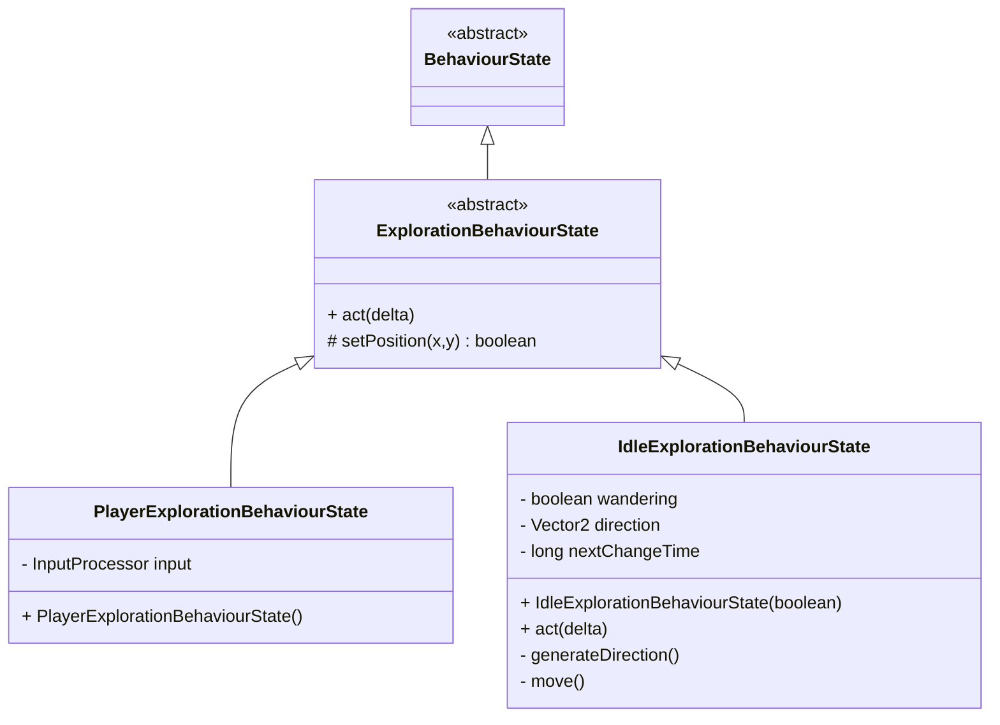
```mermaid
classDiagram
    class BehaviourState {
        <<abstract>>
    }
    class ExplorationBehaviourState {
        <<abstract>>
        + act(delta)
        # setPosition(x,y) boolean
    }
    BehaviourState <|-- ExplorationBehaviourState
    class PlayerExplorationBehaviourState {
        - InputProcessor input
        + PlayerExplorationBehaviourState()
    }
    ExplorationBehaviourState <|-- PlayerExplorationBehaviourState
    class IdleExplorationBehaviourState {
        - boolean wandering
        - Vector2 direction
        - long nextChangeTime
        + IdleExplorationBehaviourState(boolean)
        + act(delta)
        - generateDirection()
        - move()
    }
    ExplorationBehaviourState <|-- IdleExplorationBehaviourState
```

The setPosition(x,y) method of the ExplorationBehaviourState abstract class will modify the values of the position of the 
actor of the Behaviour (and its position on the screen). It works in this way:

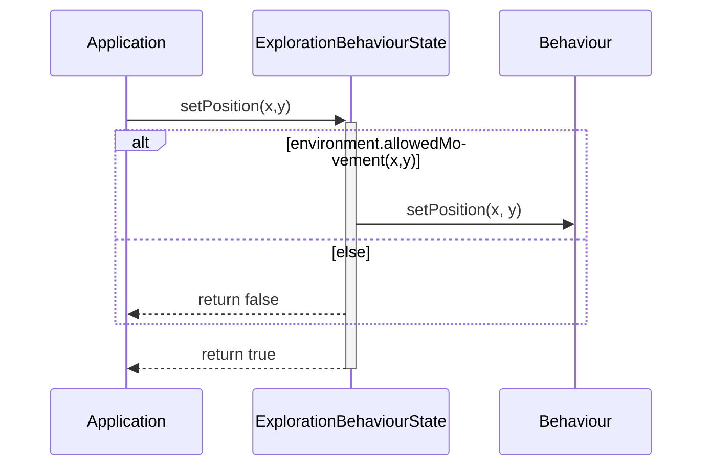
```mermaid
sequenceDiagram
    Application ->>+ ExplorationBehaviourState : setPosition(x,y)
    alt environment.allowedMovement(x,y)
        ExplorationBehaviourState ->> Behaviour : setPosition(x, y)
    else else
        ExplorationBehaviourState -->> Application : return false
    end
    ExplorationBehaviourState -->>- Application : return true
```

The InputProcessor instance (see https://libgdx.com/wiki/input/mouse-touch-and-keyboard) in the Player's Exploration
Behaviour State will update the player's position and actions during the exploration mode:
- standard WASD keys for moving
- left-click on an Item or a Creature to interact with it, opening a little dialog showing all the actions that the
player can do on that Behaviour: one button for every action. If the action can't be done (validate()
returns false), the button will be inactive.
- The player can press esc to pause the game.

The IdleExplorationBehaviourState will manage a Behaviour, typically a CreatureBehaviour, whose Creatures is minding
its own businesses: if the attribute wandering is true, the Creature will wander around, stopping if it goes "bumping"
against something. If the attribute vigil is true and the Creature sees the Player:
- if the behaviour attribute hostile is true, the Creature will trigger a fight, changing the game mode to FightMode
- else the Creature will run away from the player

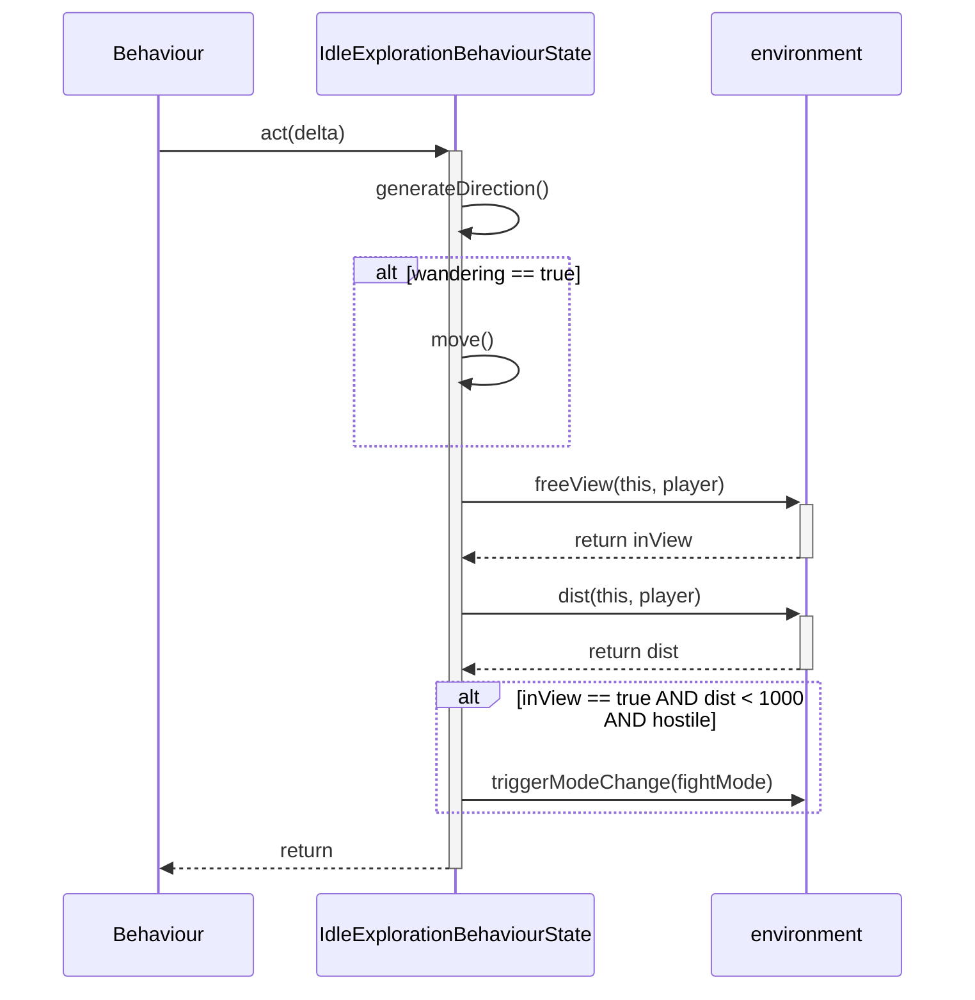
```mermaid
sequenceDiagram
    Behaviour ->>+ IdleExplorationBehaviourState : act(delta)
    IdleExplorationBehaviourState ->> IdleExplorationBehaviourState : generateDirection()
    alt wandering == true 
        IdleExplorationBehaviourState ->> IdleExplorationBehaviourState : move()
    end
    IdleExplorationBehaviourState ->>+ environment : freeView(this, player)
    environment -->>- IdleExplorationBehaviourState : return inView
    IdleExplorationBehaviourState ->>+ environment : dist(this, player)
    environment -->>- IdleExplorationBehaviourState : return dist
    alt inView == true AND dist < 1000 AND hostile
        IdleExplorationBehaviourState ->> environment : triggerModeChange(fightMode)
    end
    IdleExplorationBehaviourState -->>- Behaviour : return
```

The move() method simply moves the actor's position (deltaV = direction (vector) * delta * behaviour.getSpeed()), if
it's allowed. If it's not allowed, the movement will be stopped (direction set to null vector).

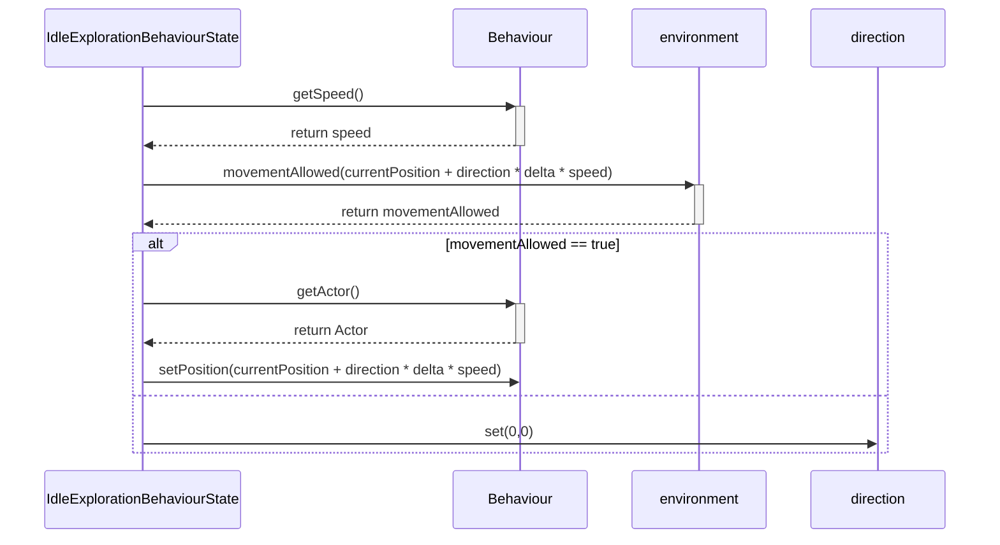
```mermaid
sequenceDiagram
    IdleExplorationBehaviourState ->>+ Behaviour : getSpeed()
    Behaviour -->>- IdleExplorationBehaviourState : return speed
    IdleExplorationBehaviourState ->>+ environment : movementAllowed(currentPosition + direction * delta * speed)
    environment -->>- IdleExplorationBehaviourState : return movementAllowed
    alt movementAllowed == true
        IdleExplorationBehaviourState ->>+ Behaviour : getActor()
        Behaviour -->>- IdleExplorationBehaviourState : return Actor
        IdleExplorationBehaviourState ->> Behaviour : setPosition(currentPosition + direction * delta * speed)
    else
        IdleExplorationBehaviourState ->> direction : set(0,0)
    end
```

The generateDirection() method will:
- if the creature is running away, set the direction as far away from the player
- else modify sometimes modify the direction, at a time generated randomly

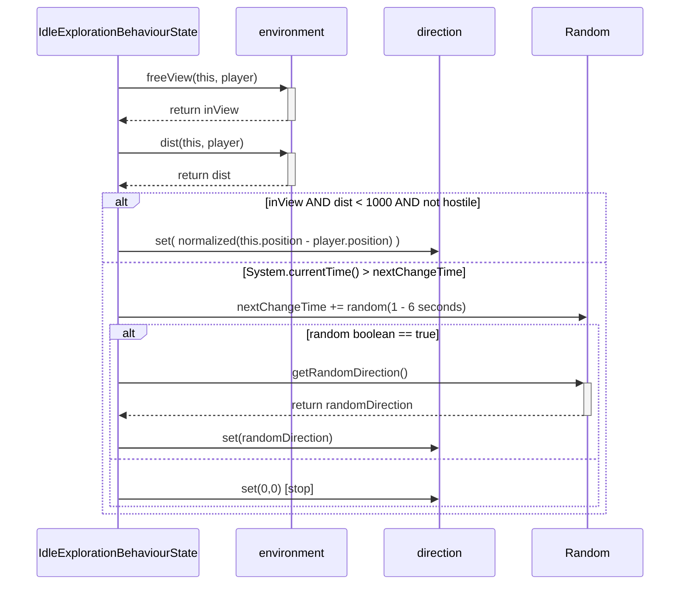
```mermaid
sequenceDiagram
    IdleExplorationBehaviourState ->>+ environment : freeView(this, player)
    environment -->>- IdleExplorationBehaviourState : return inView
    IdleExplorationBehaviourState ->>+ environment : dist(this, player)
    environment -->>- IdleExplorationBehaviourState : return dist
    alt inView AND dist < 1000 AND not hostile
        IdleExplorationBehaviourState ->> direction : set( normalized(this.position - player.position) )
    else System.currentTime() > nextChangeTime
        IdleExplorationBehaviourState ->> Random : nextChangeTime += random(1 - 6 seconds)
        alt random boolean == true
            IdleExplorationBehaviourState ->>+ Random : getRandomDirection()
            Random -->>- IdleExplorationBehaviourState : return randomDirection
            IdleExplorationBehaviourState ->> direction : set(randomDirection)
        else
            IdleExplorationBehaviourState ->> direction : set(0,0) [stop]
        end
    end
```

### FightBehaviourState package

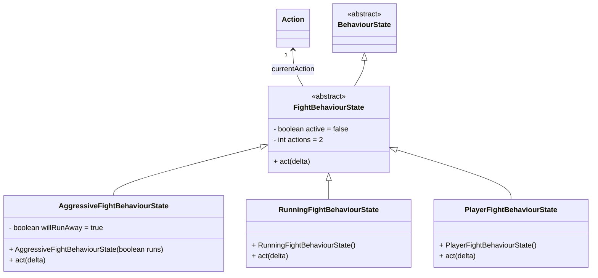
```mermaid
classDiagram
    class BehaviourState {
        <<abstract>>
    }
    class FightBehaviourState {
        <<abstract>>
        - boolean active = false
        - int actions = 2
        + act(delta)
    }
    Action "1" <-- FightBehaviourState : currentAction
    BehaviourState <|-- FightBehaviourState
    class AggressiveFightBehaviourState {
        - boolean willRunAway = true
        + AggressiveFightBehaviourState(boolean runs)
        + act(delta)
    }
    FightBehaviourState <|-- AggressiveFightBehaviourState
    class RunningFightBehaviourState {
      + RunningFightBehaviourState()
      + act(delta)
    }
    FightBehaviourState <|-- RunningFightBehaviourState
    class PlayerFightBehaviourState {
        + PlayerFightBehaviourState()
        + act(delta)
    }
    FightBehaviourState <|-- PlayerFightBehaviourState
```

In the FightBehaviourState, the attribute active is true if it's this Creature turn. Every Creature, at the
beginning of its turn, has 2 actions. The class has a reference to FightModeAction class, representing the action
that the Creature is currently doing if it's active. It will be updated at every frame in the act method.

The Aggressive Fight Behaviour will make the Creature behave in this way:
- if the player is inside its weapon range, attack
- else, move to reach the player
- if the attribute willRunAway is true and the Creature has lost 2/3 of its HP, the Creature will change its BehaviourState
to RunningFightBehaviourState

The Running Fight Behaviour State will make the Creature using its actions to move away from the Player as far as it's
possible. If it's far enough, it will simply disappear (removed from the stage of the environment).

The Player Fight Behaviour State will:
- move the player (FightModeMovementAction) if he left-presses a valid location to move 
(action instantiated and immediately started if validated)
- open a little dialog, when right-clicking a Creature or an Item, showing a button for every action in its
allowedActionList (action instantiated, validated, then started when the button is pressed)
- move the player visual with WASD (not an action)
- The player can press esc to pause the game.

### Action package

```mermaid
classDiagram
    class ActionValidator {
        <<interface>>
        + validate(environment) boolean
    }
    ActionValidator "1" <-- Action
    class AttackAction {
        + AttackAction(CreatureBehaviour attacker, Behaviour target)
        + start()
        + update()
        - manageAttack()
    }
    Action <|-- AttackAction
    AttackValidator "1" <-- AttackAction
    CreatureBehaviour "1" <-- AttackAction : attacker
    Behaviour "1" <-- AttackAction : target
    class AttackValidator {
        + AttackValidator(Behaviour attacker, Behaviour target)
        + validate(environment) boolean
    }
    ActionValidator <|-- AttackValidator
    class FightModeMovementAction {
        - int currentNodeOfThePath = 1
        + MovementAction(CreatureBehaviour mover, Vector2 destination)
        + start()
        + update()
    }
    Action <|-- FightModeMovementAction
    class MovementValidator {
        - List~Vector2~ path
        + MovementValidator(CreatureBehaviour mover, Vector2 destination)
        + validate(enviroment) boolean
        + getPath() List~Vector2~
    }
    ActionValidator <|-- MovementValidator
    MovementValidator "1" <-- FightModeMovementAction
    class CollectAction {
        + CollectAction(CreatureBehaviour creature, ItemBehaviour item)
        + start()
        + update()
    }
    Action <|-- CollectAction
    class CollectValidator {
        + CollectValidator(CreatureBehaviour creature, ItemBehaviour item)
        + validate(environment) boolean
    }
    ActionValidator <|-- CollectValidator
    CollectValidator "1" <-- CollectAction
    class TalkAction {
        + TalkAction(CreatureBehaviour c1, CreatureBehaviour c2)
        + start()
        + update()
    }
    Action <|-- TalkAction
    class TalkValidator {
        + TalkValidator(CreatureBehaviour c1, CreatureBehaviour c2)
        + validate(environment) boolean
    }
    ActionValidator <|-- TalkValidator
    TalkValidator "1" <-- TalkAction
```

The Action class represents an action that any Creature can make during its turn in fightMode or at any time
in explorationMode. The class has an endTime attribute, that will be set in the start method as the time (System.currentTime() + a
number of seconds) when the action will end. The finished method simply returns System.currentTime() > endTime. The method
validate returns true if the Action can be done.

The AttackAction class represents the Action of a Creature attacking a Behaviour (Creature or Item). In the constructor, 
the attributes attacker and target are set to the values of the parameters. Then the attack's weapon is the attacker 
primary Item. If the Item can't be cast as a weapon, or if the Creature doesn't have the skill needed to use 
the weapon (it's the Skill whose name is in the skill attribute of the weapon), the Improvised Weapon item will be used, 
instead (generated by the itemFactory). In start(), the endTime will be set as currentTime + 2 sec. The validate method 
of the AttackValidator class checks if the distance (in the environment), between the attacker and the target, is lower 
than the weapon's range and if the attacker and the target can see each other (freeView). If the action can 
be performed, the method will be called: it will use the method check() of the attacker, passing the weapon 
attribute skill as parameter. If the result of the check is greater than the target AC, it will inflict 
damages to the creature (a random value from 1 to the damage attribute of the weapon). The update method 
will perform the animation of the attack.

The FightModeMovementAction class represents the Action of a Creature moving in FightMode. In the constructor, is passed the Creature 
and the Vector2 of the destination. In the method validate, the MovementValidator will use the findPath(Creature.position, 
finish, Creature.getSpeed()) method of environment to get the list of Vector2 of the Path. If the list is empty, 
the path isn't allowed or is too long, so the validator returns false. If it returns true, when the Creature moves,
the method getPath() will be used to pass the Path to the MovementAction. In the method update, the creature will
be moved on the path: it will start moving from position 0 to position 1, than the currentNodeOfThePath attribute will
be increased, and so on, always going from position n-1 to position n, until the last one (finish position). All this
will be done in 3 seconds (endTime = currentTime() + 3 secs).

The CollectAction class represents the Action of a Creature collecting an Item. Its validator will check that the Item is
near the creature (distance < 100). In the method start, the Item will have the collect method called.

The TalkAction class represents the Action of a Creature talking to another to exchange items in their inventories.
Its validator will check that c1 is near to c2 (distance < 300). The method start will open a little dialog
where the inventories and the coins of both Creatures are shown. As the ONLY creature able to trigger this action 
will be the player, c1 will ALWAYS be the player. There will be a button sell, under the player's inventory, 
and the possibility of select one of the items of his inventory. If the player presses the sell button, the selected 
item will be moved to c2's inventory, if it's not full, the price of the Item will be devolved from c2 coins and
added to the player coins. 
Under c2's inventory, there will be a "buy" button. Pressing it, the selected item in c2 inventory will be moved
from the player's one, if it's not full, and the price of the Item will be devolved from player's coins and
added to c2's coins.

### TripBehaviourState 

```mermaid
classDiagram
    class BehaviourState {
        <<abstract>>
    }
    class TripBehaviourState { 
        <<abstract>>
        + act(delta)
    }
    World "1" <-- TripBehaviourState : gameWorld
    BehaviourState <|-- TripBehaviourState
    class PlayerTripBehaviourState {
        + PlayerTripBehaviourState()
    }
    TripBehaviourState <|-- PlayerTripBehaviourState
```

The PlayerTripBehaviourState, in its constructor, creates an InputProcessor that will move it in the TripMode map,
using WASD keys. Every time the player moves, if he arrives near a Location that hadn't been generated, it will trigger
its generation with the gameWorld reference. The same thing will happen if the Player enters a Location with a camp or
a village: he can't avoid them.

The player can press esc to pause the game.

### CreatureFactory package

```mermaid
classDiagram
    class CompositePattern {
        + CompositePattern(Texture, Action...)
        + modify(Modifier) CompositePattern
        + build() CreatureBehaviour
    }
    Pattern~CreatureBehaviour~ <|-- CompositePattern
    Action "*" <-- CompositePattern : allowedActions
    class Modifier {
        <<interface>>
        + modify(Creature)
    }
    Modifier "*" <-- CompositePattern : modifiers
    class CharacteristicSetter {
        + CharacteristicSetter(Characteristic, int value)
        + modify(Creature)
    }
    Modifier <|-- CharacteristicSetter
    class SpeedSetter {
        + SpeedSetter(int value)
        + modify(Creature)
    }
    Modifier <|-- SpeedSetter
    class SkillGiver {
        + SkillGiver(String, int)
        + modify(Creature)
    }
    Modifier <|-- SkillGiver
    class ItemEquipper {
        + ItemEquipper(Item)
        + modify(Creature)
    }
    Modifier <|-- ItemEquipper
    class ItemGiver {
        + ItemGiver(Item...)
        + modify(Creature)
    }
    Modifier <|-- ItemGiver
    class RandomModifier {
        + RandomModifier()
        + addModifier(Modifier, weight) RandomModifier
        + modify(Creature)
    }
    Modifier <|-- RandomModifier
    RandomMap "1" <-- RandomModifier
```

The CompositePattern creates a CreatureBehaviour using a Decorator, the Modifier interface. The class has a list
of modifiers, that will be applied in the build method:

```mermaid
sequenceDiagram
    Factory ->>+ CompositePattern : build()
    CompositePattern ->> creature : new ConcreteCreature
    loop for each Modifier m in the list 
        CompositePattern --> Modifier : modify(creature)
    end
    CompositePattern ->> behaviour : new CreatureBehaviour(creature)
    CompositePattern ->> behaviour : setTexture(texture)
    CompositePattern ->> behaviour : setAllowedActions(allowedActions)
    CompositePattern -->- Factory : return behaviour
```

The Modifiers are added to the array with the modify(Modifier) method of the CompositePattern class. It returns
the instance itself, allowing waterfall calls.

This is a description of Modifier's implementations:
- CharacteristicSetter(Characteristic, value) sets the Characteristic passed as parameter to value
- SpeedSetter(value) sets the speed to value
- SkillGiver(String, level) gives the Skill with the name passed as parameter, with the level passed as parameter
- ItemEquipper(Item) equips the Item passed as parameter if the Item can be equipped
- ItemGiver(Item...) adds the Items passed as parameters to the Creature's inventory
- RandomModifier() will be given various Modifiers, with the addModifier method, and then randomly use one of them
when its modify method is called. Each Modifier passed with the addModifier method has a probability of w/W to be
selected, where w is its weight, passed as parameter, and W is the sum of the weights of the modifiers passed with
the method addModifier. The method also returns the object itself, allowing waterfall calls.

Here are some patterns, with their Modifiers, of the Creatures of the game:
- Bandit: allowed actions: Attack
  - CharacteristicSetter(Physique, 12)
  - CharacteristicSetter(Agility, 12)
  - SkillGiver(Fencing, 1)
  - SkillGiver(Vitality, 1)
  - ItemEquipper(ShortSword)
  - ItemEquipper(Helm)
  - ItemEquipper(LeatherArmor)
  - ItemGiver(Silver Coins)
- Wolf: allowed actions: Attack
  - SpeedSetter(12)
  - CharacteristicSetter(Physique, 14)
  - CharacteristicSetter(Agility, 13)
  - SkillGiver(Bite, 2)
  - SkillGiver(Vitality, 1)
  - ItemEquipper(Wolf fangs)
  - ItemGiver(fur)
- Bear: allowed actions : Attack
  - CharacteristicSetter(Physique, 16)
  - CharacteristicSetter(Agility, 10)
  - SkillGiver(Bite, 2)
  - SkillGiver(Vitality, 2)
  - ItemEquipper(Bear Fangs)
  - ItemGiver(fur, fur)
- Fox: allowed actions : Attack
  - CharacteristicSetter(Physique, 8)
  - CharacteristicSetter(Agility, 14)
  - SkillGiver(Bite, 1)
  - SkillGiver(Vitality, 1)
  - ItemEquipper(Fox Fangs)
  - ItemGiver(fur)
- Villager: allowed actions : talk
  - RandomModifier() with these options:
    - ItemGiver(ShortSword, ShortSword, LongSword, Dagger, Dagger), weight 1
    - ItemGiver(ChaiMail, Helm, Helm), weight 1
    - ItemGiver(ShortBow, ShortBow, LongBow, LongBow)
    - ItemGiver(HealingPotion, HealingPotion, HealingPotion)

### ItemsFactory package

```mermaid
classDiagram
    class ItemPattern {
        - Texture texture
        - int HP
        - int AC
        - int price
        - boolean collectable
        - boolean touchable
        + build() ItemBehaviour
    }
    Pattern~ItemBehaviour~ <|-- ItemPattern
    EquipManager <-- ItemPattern : equipManager
```

The itemFactory class will be used to create instances of the ItemBehaviour class. The touchable attribute of the ItemPattern
class will be true if the Item blocks movement and view. The build method of ItemPattern (implementation of 
Pattern<ItemBehaviour>) works as shown by the Diagram:

```mermaid
sequenceDiagram
    itemFactory ->>+ ItemPattern : build()
    ItemPattern ->> newItem : new ConcreteItem()
    ItemPattern ->> newItem : setHP(HP)
    ItemPattern ->> newItem : setAC(AC)
    ItemPattern ->> newItem : setCollectable(collectable)
    ItemPattern ->> newItem : setEquipManager(equipManager)
    ItemPattern ->> newBehaviour : new ItemBehaviour(newItem)
    ItemPattern ->> newBehaviour : setTexture(texture)
    ItemPattern ->> newBehaviour : setTouchable(touchable)
    ItemPattern ->> newBehaviour : getAllowedAction().add(Attack(player,this))
    ItemPattern ->> newBehaviour : getAllowedAction().add(Collect(player,this))
    ItemPattern -->>- itemFactory : return newBehaviour
```

Here are some patterns, with their values, of the Items of the game:

| Name              | HP   | AC | price       | touchable | collectable | EquipManager               | CollectManager           | UseManager      |
|-------------------|------|----|-------------|-----------|-------------|----------------------------|--------------------------|-----------------|
| Tree              | 50   | 10 | 0           | yes       | no          | null                       | null                     | null            |
| Big Rock          | 100  | 10 | 0           | yes       | no          | null                       | null                     | null            |
| Little Rock       | 25   | 12 | 2           | no        | yes         | null                       | StandardCollectManager() | null            |
| Bush              | 25   | 10 | 0           | yes       | no          | null                       | null                     | null            |
| Little Bush       | 15   | 12 | 0           | no        | no          | null                       | null                     | null            |
| Flower            | 1    | 12 | 1           | no        | yes         | null                       | StandardCollectManager() | null            |
| Helm              | 25   | 12 | 10          | no        | yes         | Armor(2)                   | StandardCollectManager() | null            |
| Leather Armor     | 25   | 12 | 10          | no        | yes         | Armor(2)                   | StandardCollectManager() | null            |
| ChainMail         | 40   | 12 | 50          | no        | yes         | Armor(4)                   | StandardCollectManager() | null            |
| ChestPlate        | 50   | 12 | 150         | no        | yes         | Armor(5)                   | StandardCollectManager() | null            |
| ShortSword        | 40   | 13 | 50          | no        | yes         | Weapon(6, 1, fencing)      | StandardCollectManager() | null            |
| LongSword         | 40   | 13 | 40          | no        | yes         | Weapon(8, 1, fencing)      | StandardCollectManager() | null            |
| Dagger            | 30   | 13 | 25          | no        | yes         | Weapon(4, 1, fencing)      | StandardCollectManager() | null            |
| ShortBow          | 20   | 13 | 40          | no        | yes         | Weapon(6, 30, archery)     | StandardCollectManager() | null            |
| LongBow           | 20   | 13 | 50          | no        | yes         | Weapon(8, 45, archery)     | StandardCollectManager() | null            |
| Improvised Weapon | 25   | 10 | 0           | no        | no          | Weapon(3, 1, unarmedFight) | null                     | null            |
| House             | 1000 | 15 | 0           | yes       | no          | null                       | null                     | null            |
| Tent              | 20   | 8  | 0           | yes       | no          | null                       | null                     | null            |
| Fireplace         | 20   | 8  | 0           | yes       | no          | null                       | null                     | null            |
| Garpez's Leg      | 1000 | 20 | 170 000 000 | no        | yes         | null                       | StandardCollectManager() | null            |
| Silver Coins      | 20   | 10 | 0           | no        | yes         | null                       | CoinsCollectManager()    | null            |
| Fur               | 10   | 10 | 5           | no        | yes         | null                       | StandardCollectManager() | null            |
| Wolf Fangs        | 10   | 12 | 3           | no        | yes         | Weapon(4, 1, Bite)         | StandardCollectManager() | null            |
| Bear Fangs        | 15   | 12 | 4           | no        | yes         | Weapon(6, 1, Bite)         | StandardCollectManager() | null            |
| Fox Fangs         | 7    | 12 | 2           | no        | yes         | Weapon(2, 1, Bite)         | StandardCollectManager() | null            |
| Healing Potion    | 5    | 10 | 20          | no        | yes         | null                       | StandardCollectManager() | PotionManager() |

### World package

```mermaid
classDiagram
    class World {
        - int seed
        + generate(x, y) Biomes
        + contents(x, y) List~Behaviour~
    }
    class WorldGenerator {
        <<interface>>
        + generate(x, y) Biomes
        + contents(seed, x, y) List~Behaviour~
    }
    WorldGenerator <|-- StandardGenerator
    Location "*" <-- StandardGenerator : locationSet
    Location "*" <-- Environment : loadedLocationsArray
    WorldGenerator "1" <-- World : generator
    class StandardGenerator {
        + generate(x, y) Biomes
        + contents(seed, x, y) List~Behaviour~
    }
    class ConcreteEnvironment {
        - Stage stage
        - ModeName currentMode
        - ModeName nextMode
        + checkContents(x,y)
        + allowedMovement(x,y) boolean
        + dist(Vector2, Vector2) float
        + freeView(Vector2, Vector2) boolean
        + triggerModeChange(nextMode)
        + findPath(start, start) List~Vector2~
        - addLocation(x,y)
        - removeLocation(x,y)
    }
    Environment <|-- ConcreteEnvironment
    World -- Environment
    class PathFinder {
        <<interface>>
        + findPath(Vector2 start, Vector2 finish, float maxDistance) List~Vector2~
    }
    PathFinder -- Environment
    class FreePositionPathFinder {
        - Map<Vector2,boolean> freePositions
        - update()
        + findPath(Vector2 start, Vector2 finish, float maxDistance) List~Vector2~
    }
    PathFinder <|-- FreePositionPathFinder
```

The World class has a reference to a WorldGenerator object, whose method generate will be called when a new location of
the world (position x, y) has to be generated. The method contents(x, y) will be called when the player enters in 
Exploring or Fight mode, to get all the things (trees, rocks, houses, creatures, and so on)  that are in the location 
whose coordinates are x, y.

The Location class in this package has two int attributes, x and y, an attribute Biomes and an attribute Structure.

The StandardGenerator implementation of WorldGenerator has a set with every location already defined in the world,
associated to its biome. When the player triggers the generation of a new location, the generate method will be
called, defining the biome of the new location with the following algorithm:
1. Create a RandomMap with all the biomes as values, all of them with weight 1.
2. For each location l, adjacent to the location to define, check the biome: increase its weight by 1.
3. Generate a value (Biome) with the generate method of the RandomMap
4. If the biome is grassland, there's a 0.5% probability that it's got a village and a 0.5% probability that it's got
a camp.

The contents(seed, x, y) method first gets the Location in x, y in the locationSet, and if it has a structure,
it calls the corresponding ContentGenerator: VillageGenerator.generate(s) for villages, CampGenerator.generate(s) for
camps. Then it calls the ContentGenerator corresponding to its biome: GrassLandGenerator.generate(s) for grassLand
and ForestGenerator.generate(s) for forests. The seed (s) passed to these methods is always (seed + x / y).

The ConcreteEnvironment class contains the Behaviours that are currently on the screen in Exploration or Fight mode. It has 
many methods useful to Behaviours:

The checkContents will be called by the PlayerExplorationBehaviourState any time the player enters a location:
the locations that are far away will be removed from the loadedLocationsArray with the removeLocation method,
and the location that are near enough to be considered will be added to the loadedLocationsArray with the addLocation
method.
The addLocation method works in this way:

```mermaid
sequenceDiagram
    Environment ->>+ loadedLocationsArray : add(new Location(x,y))
    Environment ->>+ World : contents(x, y)
    World -->>- Environment : return contentsList
    loop for each Behaviour b in contentsList
        Environment ->> stage : addActor(b)
    end
```

The removeLocation method works in this way:

```mermaid
sequenceDiagram
    Environment ->>+ loadedLocationsArray : remove(location)
    loop for each Behaviour b in the Stage
        alt b.originalLocation == location
            Environment ->> stage : removeActor(b)
        end
    end
```

The allowedMovement(x,y) method will return true if the coordinates (floats, they don't show a location but an actual
position in the map) are free and a Creature can move in it. It works calling the hit method on the stage object of
the ExplorationMode class: the method will return the actor (a Behaviour, in our case) that is in that particular
location. It will block the movement if its touchable attribute is set as true. Things like Creatures and big solid
Items (walls, trees, rocks, ...) blocks the movement.

The dist(Vector2, Vector2) method returns the distance between two points, by simply finding them in the stage
and calculating the distance with the Pythagoras Theorem.

The freeView(Vector2, Vector2) method returns if it's possible draw a line between the two points passed as
parameters:

```mermaid
sequenceDiagram
    Application ->>+ Environment : freeView(p1, p2)
    Environment ->> Environment : dist.x = p2.x - p1.x
    Environment ->> Environment : dist.y = p2.y - p1.y
    Environment ->> Environment : vector p1 = p1.position
    loop for i, from 0 to dist.module / 10
        Environment ->>+ stage : hit(x + dist.x / 10 * i, y + dist.y / 10 * i)
        stage -->>- Environment : return hitActor
        alt hitActor != null AND hitActor != Behaviour1 AND hitActor != Behaviour2
             Environment -->> Application : return false
        end
    end
    Environment -->>- Application : return true
```

The currentMode and nextMode attributes of Environment will be modified if the game has to change its mode, with the
triggerModeChange(nextMode) method, that simply sets nextMode as the value passed as parameter. Then the GreatGame
class will manage it.

The FreePositionPathFinder class, implementation of PathFinder, is used to find a path between two points of 
the environment, using a pathfinding algorithm. The maxLength passed as parameter is the max length that the path
can have.
The graph used by this algorithm is represented by the freePositions map: for every position in the loaded locations of
the environment, with a step of 50 pixels, is stored a boolean that says if the movement is allowed in that position:

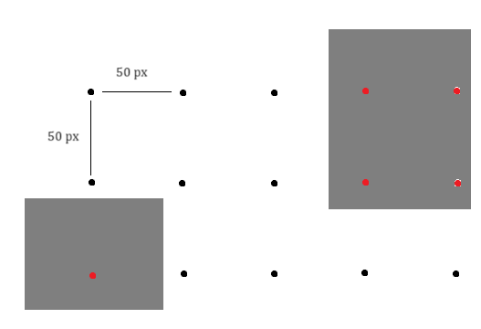

*In this image, a there's a graphic representation of freePositions map:
the grey rectangles represent Behaviours that block movement. The black points
represent free points (true value), and the red ones the occupied points (false value)*

The update method will be called every time the path method is called, it updates the freePositions map:
- it removes all the positions that are no longer loaded in the environment
- it adds all the positions tha were recently loaded in the environment
- it updates all the values of the positions loaded in the environment (with the allowedMovement(position))

Before the description of the algorithm, let's define a data structure, the Node, that has three attributes:
- Position: vector2, the position of this Node in the map
- Previous: vector2, the position of the previous Node in the map
- Length: float, the distance of this Node from the start
This is the algorithm used to find the path:
1. If the finish position, passed as parameter, doesn't allow movement (allowedMovement == false), return an empty list
2. Find the positions in the map closest to the start and the finish passed as parameters: let's call them s and f.
3. Create an empty set Done, an empty set Current and an empty set Checking. 
4. Add the Node (s, start, dist(s, start)) to Current.
5. For each Node C in Current, and for each free position P that is adjacent to C.position and isn't in D or in C,
add the Node(P, C, C.Length + 50) to Checking. If C.dist + 50 > maxLength, return an Empty List.
6. Move all the nodes in Current in Done. Move all the nodes in Checking to Current.
7. If in Current there's a Node F whose position p is equal to f, go to point 8. Else, go to point 5.
8. Create an empty list: put F.position in it. Move all the Nodes in set Current to set Done.
9. Put F.previous at the beginning of the List. Set F as the Node in Done that has F.previous as position. Repeat until
F.position is equal to s.
10. Return the list.

### Content Generators package

```mermaid
classDiagram
    class ContentGenerator {
        <<abstract>>
        # generateContent(int seed) List~Behaviour~
    }
    class VillageGenerator {
        - static VillageGenerator instance
        - VillageGenerator()
        # generateContent(int seed) List~Behaviour~
        + static generate(int seed) List~Behaviour~
    }
    ContentGenerator <|-- VillageGenerator
    class CampGenerator {
        - static CampGenerator instance
        - CampGenerator()
        # generateContent(int seed) List~Behaviour~
        + static generate(int seed) List~Behaviour~
    }
    ContentGenerator <|-- CampGenerator
    class GrassLandGenerator {
        - static GrassLandGenerator instance
        - GrassLandGenerator()
        # generateContent(int seed) List~Behaviour~
        + static generate(int seed) List~Behaviour~
    }
    ContentGenerator <|-- GrassLandGenerator
    class ForestGenerator {
        - static ForestGenerator instance
        - ForestGenerator()
        # generateContent(int seed) List~Behaviour~
        + static generate(int seed) List~Behaviour~
    }
    ContentGenerator <|-- ForestGenerator
```

The ContentGenerator abstract class is called in the content method of StandardGenerator class, to generate the contents
of the various biomes and structures: all the extensions of the class are singletons, they have a private, static instance
of themselves whose method generateContent is called in the static generate(seed). The generateContent method of
ContentGenerator, that will be called with super at the beginning of its overrides, sets the seed of the Random generator
as the seed passed as parameter, that will always be the same for a certain location. So every time the location is
generated, it will have the same items and creatures in the same places.

The VillageGenerator method generate:
- places some houses (4-8) randomly
- places a villager for each house

The CampGenerator method generate:
- places a fireplace at the center of the location
- places three tents around the fireplace
- place some bandits (3-6) near the tents
- EASTER EGG: if the Random is able to randomly generate the letters: 'G', 'a', 'r', 'p', 'e', 'z', in this order,
adds a Garpez's Leg near the fireplace

The GrassLandGenerator method generate:
- places some trees (1-5) randomly
- places some bushes (3-10) randomly
- places some rocks (3-6) randomly
- places some little bushes (10-20) randomly
- places some little rocks (10-20) randomly
- places some flowers (30-50) randomly
- places 1-6 wolves with a probability of 5 %

The ForestGenerator method generate:
- places some trees (10-20) randomly
- places some bushes (10-20) randomly
- places some rocks (3-6) randomly
- places some little bushes (15-25) randomly
- places some little rocks (10-20) randomly
- places some flowers (30-50) randomly
- places 1-2 foxes with a probability of 10 %
- places a bear with a probability of 5 %

After the generation of every Behaviour, the method setName (from Actor class) will be called, the name set as:
Type_locationX_locationY_positionX_positionY (unique for every Behaviour). Also, the locationX and locationY methods
of the Behaviour will be set and the Type string will be set as the pattern's name.

If the location has already been generated, the game will check the BehaviourInfo classes in the Location and update
all its properties: HP, positions etc., so that all the Behaviours will be just like the last time the player has been
in that Location.

### Application package

```mermaid
classDiagram
    class Mode {
        <<abstract>>
    }
    class GreatGame {
        + create()
        + render()
        + dispose()
        - manageModeChange(current, next)
    }
    Mode "1" <-- GreatGame : currentMode
    World "1" <-- GreatGame : gameWorld
    class Mode {
        <<abstract>>
        - GreatGame app
        # Stage stage
        + draw()
    }
```

The game modes are implemented by a state design pattern: the Application class has a reference to the current Mode,
the current Mode has a reference to the Application itself and to the previous Mode.
The stage (see https://libgdx.com/wiki/graphics/2d/scene2d/scene2d-ui) will be drawn in the draw method, called by
GreatGame.

The GreatGame class extends the Application class (https://javadoc.io/doc/com.badlogicgames.gdx/gdx/latest/com/badlogic/gdx/Application.html).
The method create will be called when the application is launched, the method render will be called at every frame and will
call the update method of the currentMode. The method dispose will be called when the application is closed.

This diagram shows what happens every frame, in the render method:

```mermaid
sequenceDiagram
    GreatGame ->> GreatGame : glClear(Black)
    GreatGame ->> currentMode : draw()
    GreatGame ->>+ gameWorld : getEnvironment().getCurrentMode()
    gameWorld -->>- GreatGame : return currentMode
    GreatGame ->>+ gameWorld : getEnvironment().getNextMode()
    gameWorld -->>- GreatGame : return nextMode
    alt currentMode != nextMode
        GreatGame ->> GreatGame : manageModeChange(currentMode, nextMode)
    end
```

The manageModeChange method calls:
- currentMode = new FightMode(world.getEnvironment()), if nextMode is fight
- currentMode = new ExplorationMode(world.getEnvironment()), if nextMode is exploration
- currentMode = new TripMode(world.getEnvironment()), if nextMode is trip
- currentMode = new MainMenuMode(world.getEnvironment()), if nextMode is mainMenu

#### Exploration Mode subpackage

```mermaid
classDiagram
    class Mode {
        <<abstract>>
    }
    class ExplorationMode {
        + ExplorationMode(environment)
        + draw()
    }
    Environment <-- ExplorationMode : environment
    Mode <|-- ExplorationMode
```

The ExplorationMode(environment) constructor sets all the CreatureBehaviours of the stage to a ExplorationBehaviourState:
PlayerExplorationBehaviourState for the Player, IdleExplorationBehaviourState for the others.

The method draw of this extension of Mode also renders the environment stage.

In the ExplorationMode stage there will be a button, in the right-bottom zone of the screen, the "Trip" button. Clicking
on it, the Player will enter TripMode in the Location where he is: first the environment's stage will be emptied, except
for the player's Behaviour. Then, the triggerModeChange method of environment will be called.

In the ExplorationMode stage there will be a button, in the left-bottom zone of the screen, the "Skills" button.
Clicking on it, the Player will open a little dialog where is shown his Skills and their levels, and the current 
Experience Points of the Player. There will be a button near to every Skill, that can be pressed if the player wants
to spend XP to increase his level. This can be done only if the player has enough XP for that.
There will also be an "Inventory" button that will show a little dialog when clicked, a dialog with 8 images displayed:
they will display the textures of the items in the Player's inventory. There will also be three other images: one for
the PrimaryItem, one for the HeadItem, one for the ChestItem. Clicking on the texture of an Item that can be equipped
will make the game equip it in the corresponding slot. If the slot is already taken, then the item in the slot will be
first unequipped. Clicking on the texture of an Item that can be used will make the game activate it.

There will be also a label showing the current HP of the Player.

#### Fight Mode subpackage

```mermaid
classDiagram
    class Mode{
        <<abstract>>
    }
    class FightMode {
        + FightMode(envoirment)
        + draw()
    }
    Environment <-- FightMode : environment
    Behaviour "*" <-- FightMode : fighters
    Mode <|-- FightMode
```

The Constructor creates a new FightMode, setting all the CreateBehaviours to a FightBehaviourState: AggressiveFightBehaviourState
for hostile ones, PlayerFightBehaviourState for the player and RunningFightBehaviourStates for the other. It also creates
the fighters array, where are contained the Creatures that are in the fight (sorted by their Agility characteristic, 
decreasing). Sets the active attribute of the FightBehaviourState of the first Creature of the array as true.

The draw method of this extension also renders the environment stage. If the only Creature of the fight array that is
active has finished its actions, that Creature will be deactivated and the next one in the array will be activated
(i.e. the active attribute of their FightBehaviourState will be modified).
The draw method also checks if the Player is the only Behaviour in the fighters array. If it is, then all the other are
dead or have run away. So it calls triggerModeChange(exploration). At every frame, the method also checks that
the Creatures in the fighter array are still alive: if one has less than 0 HP, it removes it from the array. If the
Behaviour that has less than 0 HP is the player, a little dialog "Game Over" will appear and then the game will
pass to MainMenuMode. Else, if the one that has less than 0 HP isn't the player, the EP of the player will be increased
by 100.

In Fight Mode there will be the buttons "Skills" and "Inventory" just like in ExplorationMode.

#### Trip Mode subpackage

```mermaid
classDiagram
    class Mode {
        <<interface>>
    }
    class TripMode {
        + TripMode(x, y)
        + draw()
    }
    World "1" <-- TripMode : gameWorld
    Mode <|-- TripMode
```

The Constructor creates a new TripMode, filling its stage with a map, composed by many images, each showing the Biome and
Structures of a particular Location. The player will be set in TripBehaviourMode. There will also be an icon displaying 
where the player is. The gameWorld references to the world in the GreatGame class.

In this Mode, the Environment in the World class will only contain the Player's Behaviour. It will also be used to
trigger Mode changes with its currentMode and nextMode attributes.

In the TripMode stage there will be a button, in the right-bottom zone of the screen, the "Explore" button. Clicking
on it, the Player will enter ExplorationMode in the Location where he is: first the environment will be filled with
the contents of the Location (and the ones near to it) with the content method of gameWorld. Then, the triggerModeChange
method of environment will be called.

In Trip Mode there will be the buttons "Skills" and "Inventory" just like in ExplorationMode

#### Menu Mode subpackage

```mermaid
classDiagram
    class Mode {
        <<abstract>>
    }
    class MainMenuMode {
        - Stage mainMenuStage
        - Stage pauseStage
        - Stage newGameStage
        - Stage saveGameStage
        - Stage loadGameStage
        - Stage currentStage
        + MainMenuMode()
    }
    Mode <|-- PauseMode
```

This mode will be used both for main menu and for pause. It will show one of these stages:
- mainMenuStage: the starting page of the game, with the title and some buttons:
    - New Game: will show newGameStage
    - Load Game: will show loadGameStage
    - Quit Game: closes the Application
- pauseStage: the page that will open if the player pauses the game. It has some buttons:
    - Save Game: will show saveGameStage
    - Load Game: will show loadGameStage
    - Back to Main menu: will show mainMenuStage
    - Quit Game: closes the Application
- saveGameStage: the stage where the player can save the current game, to load it another time. It contains a list with
the games already saved (stored in a directory), a button to create a new save and a button to override an existing
save.
- loadGameStage: the page where the player can load a game already created (stored in a directory). It contains a list
with the games already saved, a button to load them, starting the game where it was saved.
- newGameStage: the page where the player can define his character: he will determine the Characteristics
(random generated) and the skills (they're stored in a list). The player has a starting amount of 1000 EP. 
Increase a Skill to the 1st level costs 200 EP, to the 2nd level costs 400 EP more. When the player is done (click "Done"
button), the game will start: a player CreatureBehaviour will be created, modified according to the choices the player
did and added to the gameWorld environment in position 0,0. Also, the Location (0,0), where the player starts, 
and the Locations near to it will be generated. Then the environment triggerModeChange(exploration) method will be called.

When the game is saved, all information about the world are saved in a file: 
- the player's behaviour: its HP, position, current equipment and inventory
- the current mode
- the current location
- every location already generated in the World class is written in a file using toString() method, with all
its BehaviourInfo

To load a game, the file will be loaded and the various object will be parsed, so that all the locations already generated
will be put in the world. Then, the environment will be initialized with:
- the player
- the game will enter the saved mode in the current location, with the locations near to it
